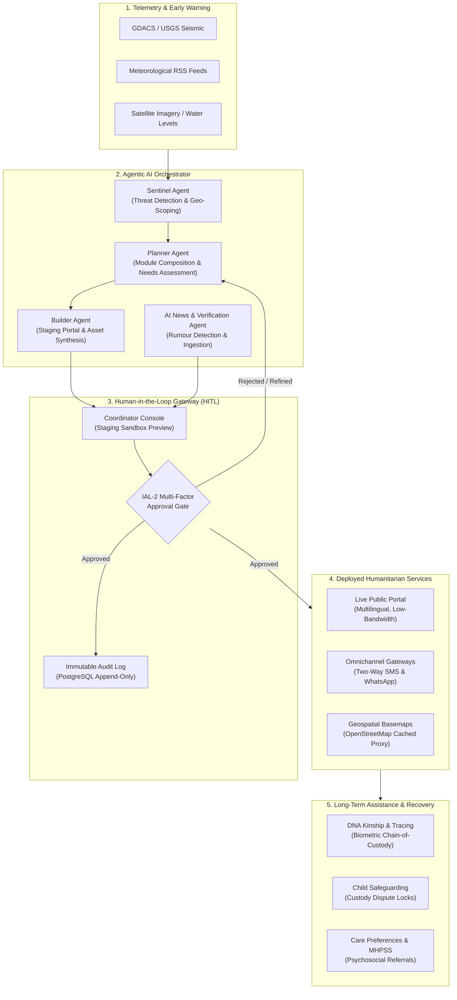

# FamilyConnect: Agentic AI Architectural Capabilities & Humanitarian Framework

> **Evaluation, Assessment, and Technical Reference**  
> **Standards Alignment:** ICRC Humanitarian Technology Framework, NIST SP 800-63B (IAL-2), OWASP Top 10, RFC 9457 Problem Details.

---

## Executive Summary

FamilyConnect implements an enterprise-grade **Agentic AI Humanitarian Framework** designed to bridge the critical gap between autonomous crisis detection and rapid field service mobilization. The architecture strictly rejects unchecked generative execution in favor of a **Human-in-the-Loop (HITL) Triaged Agentic Model**:

1. **Autonomous Discovery & Scoping:** AI agents detect emerging disasters, establish geographic bounds, and scope service needs.
2. **Deterministic Architecture Generation:** The AI designs and stages an event-specific humanitarian portal with tailored modules (shelters, safe water, tunnel operations, DNA tracing).
3. **Mandatory Human Verification (IAL-2):** Authorized disaster coordinators review, refine, and formally authorize service deployment.
4. **Post-Event Recovery & Reconnection:** The platform transitions smoothly from emergency triage to long-term family reunification, child safeguarding, and psychosocial recovery.

---

## 1. System Architecture Diagram



---

## 2. Pillar Analysis & Technical Capabilities

### Pillar 1: Planning (Situational Awareness & Autonomous Event Discovery)

* **Codebase Reference:** [`src/services/orchestrator/sentinelAgent.js`](file:///Users/shilpadhall/erdos/familyconnect/build/familyconnect/src/services/orchestrator/sentinelAgent.js)
* **Mechanisms:**
  * **Automated Telemetry Polling:** Monitors global disaster alert systems (GDACS, USGS), meteorological gauges, and governmental crisis feeds.
  * **Classification & Boundary Extraction:** Extracts event type (`GLOF`, `FLOOD`, `EARTHQUAKE`), epicenter, and regional bounding box coordinates.
  * **Domain Isolation:** Enforces strict boundary checks to prevent cross-disaster bleed (e.g. separating the **Nepal–Tibet Glacial Outburst** from the **Assam Brahmaputra Basin Flooding** so coordinates, relief centers, and basemaps remain strictly segregated).

### Pillar 2: Design (Dynamic Module Composition & Schema Synthesis)

* **Codebase References:** 
  * [`src/services/orchestrator/moduleRegistry.js`](file:///Users/shilpadhall/erdos/familyconnect/build/familyconnect/src/services/orchestrator/moduleRegistry.js)
  * [`src/services/orchestrator/plannerAgent.js`](file:///Users/shilpadhall/erdos/familyconnect/build/familyconnect/src/services/orchestrator/plannerAgent.js)
  * [`frontend/js/app.js`](file:///Users/shilpadhall/erdos/familyconnect/build/familyconnect/frontend/js/app.js)
* **Mechanisms:**
  * **Declarative Module Registry:** Instead of static websites, the Planner Agent selects from a catalog of humanitarian modules:
    * `MOD-TUNNEL`: Deep tunnel operations and shift tracking (essential for mountain/GLOF events).
    * `MOD-WATER-PT`: Potable water distribution and tanker dispatch (flood crises).
    * `MOD-SHELTER`: High-capacity evacuation shelter registries.
    * `MOD-DNA`: Kinship reference collection for mass casualty tracing.
    * `MOD-RUMOUR`: Misinformation debunking and community broadcast.
  * **Zero-Code Navigation Synthesis:** The frontend dynamically renders localized navbars, emergency hotlines, and routing based on the event's active modules.

### Pillar 3: Execution (Multi-Agent Orchestration & Intelligence Verification)

* **Codebase References:**
  * [`src/services/orchestrator/builderAgent.js`](file:///Users/shilpadhall/erdos/familyconnect/build/familyconnect/src/services/orchestrator/builderAgent.js)
  * [`src/services/newsAgent.js`](file:///Users/shilpadhall/erdos/familyconnect/build/familyconnect/src/services/newsAgent.js)
* **Mechanisms:**
  * **Builder Sandbox:** Assembles staging configuration, regional translation dictionaries, and centroid coordinates prior to deployment.
  * **Autonomous Fact-Checking:** The AI News Collector ingests local news dispatches on recurring schedules (6h / 24h). Unverified claims or rumors are automatically triaged into a review queue (`/api/v1/news/queue`) for human validation before publishing.

### Pillar 4: Tool Integration (Geospatial, Omnichannel & Cloud Deployment)

* **Codebase References:**
  * [`frontend/js/map.js`](file:///Users/shilpadhall/erdos/familyconnect/build/familyconnect/frontend/js/map.js)
  * [`src/modules/tiles/routes.js`](file:///Users/shilpadhall/erdos/familyconnect/build/familyconnect/src/modules/tiles/routes.js)
  * [`src/modules/gateways/routes.js`](file:///Users/shilpadhall/erdos/familyconnect/build/familyconnect/src/modules/gateways/routes.js)
  * [`.github/workflows/deploy-azure-container-apps.yml`](file:///Users/shilpadhall/erdos/familyconnect/build/familyconnect/.github/workflows/deploy-azure-container-apps.yml)
* **Mechanisms:**
  * **Self-Hosted OpenStreetMap Tile Proxy:** Resolves CORS, hotlinking restrictions, and watermark issues by serving cached vector/raster tiles directly from the application backend with high-speed disk caching.
  * **Omnichannel Low-Bandwidth Gateway:** Supports 2G and non-smartphone users via two-way SMS and WhatsApp simulation, parsing emergency commands (`SAFE`, `MISSING`, `WATER`, `SHELTER`).
  * **Automated CI/CD Deployment:** GitHub Actions automatically boots an isolated PostgreSQL 16 container, runs migrations and seeds, executes the 44-test verification suite, builds container images in Azure Container Registry (ACR), and rolls out zero-downtime revisions to Azure Container Apps.

---

## 3. Continuous Enhancement & Human-in-the-Loop (HITL)

Human oversight is not an afterthought—it is a cryptographic precondition for deployment:

| Capability | Autonomous Agent Role | Human Coordinator Role |
| :--- | :--- | :--- |
| **Crisis Detection** | Scans feeds, identifies threat magnitude, drafts bounding box | Confirms event validity, declares official regional crisis |
| **Service Scoping** | Proposes active modules (e.g., Water Points + Shelters) | Adds, removes, or reconfigures module priorities |
| **Launch Authorization** | Generates sandbox staging preview | Authorizes production rollout via **`IAL-2` MFA** sign-off |
| **Misinformation Control** | Scrapes field rumors and drafts debunking copy | Approves official counter-statements before public display |

```bash
# Example IAL-2 Gated Review Endpoint
POST /api/v1/orchestrator/review/:id
Headers: 
  Authorization: Bearer <token-with-IAL-2>
  X-Correlation-ID: <uuid>
Body:
  {
    "action": "APPROVE",
    "comments": "Approved for live deployment across Langtang border sector.",
    "customModifications": ["MOD-DNA", "MOD-TUNNEL"]
  }
```

---

## 4. Post-Event Humanitarian Assistance & Long-Term Recovery

Immediate emergency response (evacuation and headcounts) transitions into long-term humanitarian case management:

```
                       POST-CRISIS TIMELINE & SERVICE TRANSITION
  Day 0 - 3                   Day 3 - 14                  Day 14 - 90+
┌───────────────────────────┐┌───────────────────────────┐┌───────────────────────────┐
│ • Safe Declarations       ││ • Family Tracing Matches  ││ • DNA Kinship Verification│
│ • Emergency Shelters      ││ • Medical Triage Referrals││ • Child Safeguarding Closes│
│ • Potable Water Tankers   ││ • Proof of Life Dossiers  ││ • Cross-Border Repatriation│
│ • Tunnel Worker Rosters   ││ • Disputed Custody Flags  ││ • Long-term MHPSS Referrals│
└───────────────────────────┘└───────────────────────────┘└───────────────────────────┘
```

1. **DNA Kinship Tracing (`MOD-DNA`)**:
   * Secure, privacy-preserving reference sampling for mass-casualty or cross-border identification.
   * Pseudonymized case references (`FC-DNA-YYYY-XXXX`) prevent biometric data exposure.
2. **Child Safeguarding & Custody Protection (`MOD-SAFEGUARDING`)**:
   * Automatic dispute locks (`FC_ERR_403_DISPUTED_ACCESS`) if conflicting claims arise over unaccompanied minors.
   * Tamper-evident handover protocols with digital chain-of-custody signatures for multi-agency handoffs.
3. **Care Preferences & Cultural Reintegration**:
   * Records dietary, linguistic, religious, and pediatric medical needs to assist resettlement and social agency follow-up.
4. **Mental Health & Psychosocial Support (MHPSS)**:
   * Direct routing from Family Assistance Centers to verified psychiatric, grief counseling, and consular desks.

---

## 5. Architectural Maturity & Recommendations

| Area | Current Implementation | Target Horizon |
| :--- | :--- | :--- |
| **Early Warning** | Multi-source meteorological & alert scrapers | Direct Copernicus EMS & Sentinel-1 Synthetic Aperture Radar (SAR) flood inundation overlays |
| **Form Synthesis** | Pre-registered module templates | Autonomous JSON-Schema generation for emergent relief needs (e.g. insulin registries) |
| **Field Access** | Plain SMS/WhatsApp gateway simulation | Official WhatsApp Cloud API Interactive Buttons & USSD menu fallback for 2G networks |
| **Agent Memory** | Stateless per-invocation orchestration | Vector memory store tracking past coordinator overrides to refine future crisis proposals |

---
*Authored for the FamilyConnect Disaster Management Technical Committee.*
